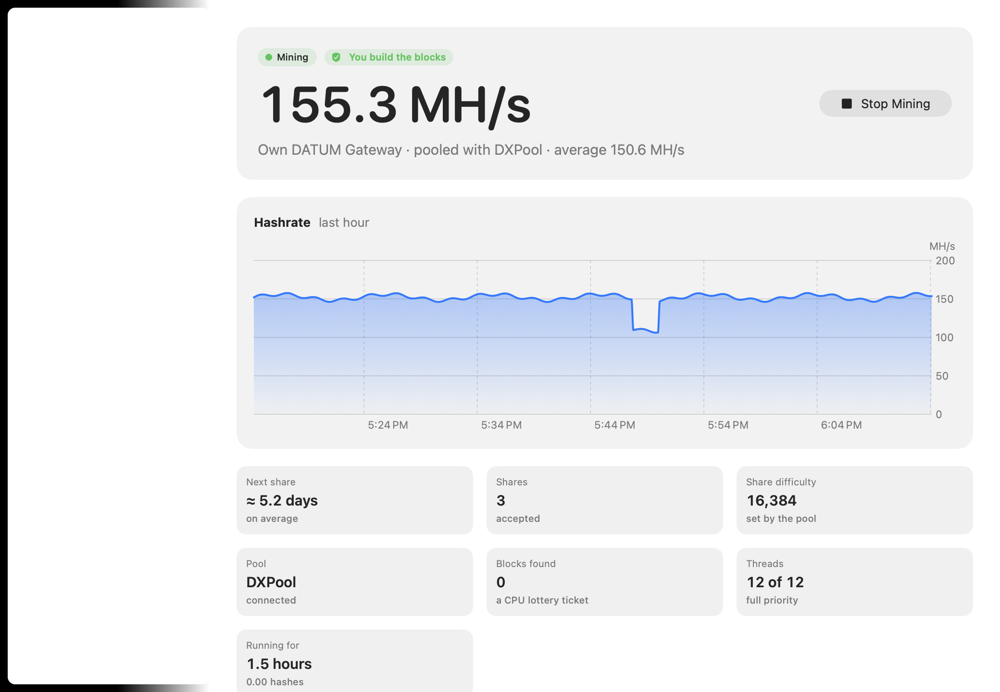
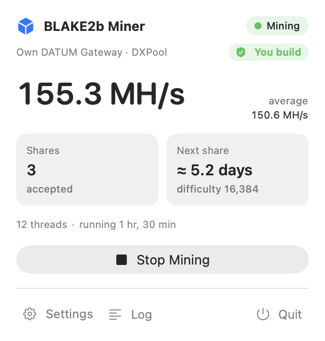

# BLAKE2b Miner

A fast CPU miner for macOS for the **Bitcoin Knots BLAKE2b chain** (header v2
proof of work, live since block 961,640). It runs as a small menu-bar app,
and also ships a command-line tool.

<p align="center">
  
</p>
<p align="center">
  
</p>

**Built for decentralization: by default, your own node builds the blocks you
mine.** The app shows who builds the blocks for every mode:

| Mode | Who builds the blocks | How |
| --- | --- | --- |
| **My own DATUM Gateway** (recommended) | ✅ **You** | The app runs a [DATUM Gateway](https://github.com/CONVOYMining/datum_gateway) next to your Knots node. Join a DATUM pool, where the pool only coordinates payouts, or mine solo. |
| **Solo, directly with my node** | ✅ **You** | Templates straight from your Knots node; a block you find pays you in full. |
| Pool-hosted gateway | ⚠️ The pool | Connect to a pool's public gateway. Simplest, but the pool chooses the transactions. |

- **Runs on any Mac with macOS 13 Ventura or later**: one universal app for
  Apple Silicon and Intel, with the DATUM Gateway built in. No Python, Xcode,
  Homebrew or other dependencies.
- **Fast native engine**: about 320 MH/s on a 12-core M4 Pro Mac mini, from a
  hand-written ARM64 assembly kernel that runs NEON (with the SHA3 extension's
  `XAR` instruction) and the integer units side by side. Intel Macs use a
  portable C kernel.
- **Verifiable**: built-in self-test against the official Knots test vectors
  and against real blocks from your node.

> **Be realistic.** A CPU is a tiny fraction of the network's hashrate. At
> 300 MH/s and difficulty 4.6 G, the expected time to solo-mine one block is
> about two thousand years, and pool shares may take days. Think of it as a lottery
> ticket that also supports the network's decentralization, not as income.

## Install

1. Download `BLAKE2bMiner-<version>-macOS.dmg` (or `.zip`) from
   [Releases](../../releases) and drag **BLAKE2b Miner** to Applications.
2. Open it. The release builds aren't notarized by Apple, so the first time
   macOS will say it can't verify the developer:
   - macOS 15 and later: click **Done**, then open **System Settings ›
     Privacy & Security**, scroll down and click **Open Anyway**.
   - macOS 13–14: right-click the app, choose **Open**, then **Open**.

   Or run this in Terminal once:
   `xattr -dr com.apple.quarantine "/Applications/BLAKE2b Miner.app"`
3. The dashboard opens on first launch. Afterwards the app lives in the menu
   bar (the cube icon); **Open Dashboard** brings the window back.

## Set up your node

You need [Bitcoin Knots](https://bitcoinknots.org) 29.4.1 or later, fully
synced on the BLAKE2b chain, with its RPC server enabled:

- **Bitcoin Knots app (Bitcoin-Qt):** Settings › Options › check **Enable
  RPC server**, then restart Knots. Or add `server=1` to `bitcoin.conf`.
- **bitcoind:** add `server=1` to `bitcoin.conf`.
- **For pooled DATUM mining** also add `blockmaxweight=785000` to
  `bitcoin.conf`, so every block your node builds has room for the pool's
  payout outputs.

The miner signs in to the node with its cookie file from the default data
directory (`~/Library/Application Support/Bitcoin`). If your node uses another
data directory or `rpcuser`/`rpcpassword`, set them on the **Node** page. An
RPC password is kept in your macOS Keychain.

## Mine with your own DATUM Gateway (recommended)

[DATUM](https://github.com/CONVOYMining/datum_gateway) lets you pool with
other miners while **your own node chooses the transactions and builds every
block**; the pool only coordinates the payouts, straight from the coinbase.
BLAKE2b Miner ships the CONVOY DATUM Gateway inside the app and runs it for
you. There's nothing to install or configure by hand.

1. **Dashboard › Mining:** choose *My own DATUM Gateway*, paste a payout
   address from your own wallet, and pick a DATUM pool, or *None* to mine solo
   through the gateway.
2. **Dashboard › Diagnostics › Run All Checks** should show green checks.
3. Click **Start Mining**. The menu shows the pool connection and your shares.

| DATUM pool | Fee | Server |
| --- | --- | --- |
| [DXPool](https://www.dxpool.net/help/en/tutorial/dxpool-datum-gateway-mining/) | see dxpool.net | `xbt.datum.dxpool.com:28915` |
| [Xor Pool](https://xorpool.com) | 1% | `datum.xorpool.com:28915` |
| [CONVOY](https://convoy.xyz) | 1% | `datum-beta1.mine.convoy.xyz:28915` |
| [Tyger Pool](https://tygerpool.com) | 0% (launch) | `tygerpool.com:28915` |

Each pool's public key is built in and authenticates the pool, so nobody can
impersonate it and redirect your payouts. Every pool above was verified by
completing the encrypted DATUM handshake from a real node with the bundled
gateway, and receiving work built by that node.

If the pool becomes unreachable, the gateway keeps mining solo by default
(any block pays you 100%); you can switch this off. You can also let ASICs on
your network mine through your gateway (Dashboard › Mining › Advanced).

> Pools set a minimum share difficulty for ASICs (16,384 for all four pools at
> the time of writing). At 300 MH/s that's about one share every 2.7 days, so
> expect rare, tiny payouts.

## Solo mining directly with your node

Choose *Solo, directly with my node* on the **Mining** page and set your
payout address. The miner builds blocks from your node's templates, and the
node validates each one (`getblocktemplate` proposal mode) before any hashing.
A block you find pays the full reward to you.

## Pool-hosted gateways

Some pools run public gateways that miners connect to directly
([DXPool](https://www.dxpool.net/help/en/tutorial/dxpool-datum-gateway-mining/),
[Xor Pool](https://xorpool.com) US/EU/Asia over TLS). It's the simplest setup,
but **the pool's node chooses the transactions** in the blocks you mine, so
the app marks it "The pool builds the blocks". Some pools have announced that
they'll favor miners who build their own blocks. Use *My own DATUM Gateway*
when you can.

## The app

BLAKE2b Miner lives in the **menu bar**: click the cube for your hashrate,
next share or expected block, and Start/Stop. **Open Dashboard** (⌘D) opens
the main window. You can also open it by opening the app again from Finder or
Spotlight. The window can be resized or made **full screen**, and while it's
open the app also appears in the Dock.

| Page | What's there |
| --- | --- |
| **Overview** | Live hashrate, a one-hour hashrate chart, shares or expected block, pool connection, blocks found, recent activity. |
| **Mining** | How to mine (own DATUM Gateway, solo, or a pool-hosted gateway), your payout address (checked as you type), and the pool. |
| **Performance** | CPU threads, *Keep the Mac responsive* (lower priority), pause on battery, keep the Mac awake, open at login, start mining when the app opens, hashrate in the menu bar. |
| **Node** | How to reach Bitcoin Knots: address, port, data directory, optional RPC user and password. |
| **Diagnostics** | **Run All Checks**: node reachable, synced, BLAKE2b templates, payout address in your wallet, `blockmaxweight`, and the hashing against the official test vectors and your node's recent blocks. |
| **Log** | Everything the miner and its DATUM Gateway report. |

If something stops mining (for example, Knots isn't running), the menu and
the Overview say so and offer **Show Log** and **Run Checks**.

## Troubleshooting

| Problem | What to do |
| --- | --- |
| "No RPC cookie found" | Knots isn't running, its RPC server is off (`server=1`), or it uses another data directory: set it in **Settings › Node**. |
| "The node is still syncing" | Wait until Knots has synced; mining before that would waste work. |
| "not a BLAKE2b (header v2) block" | The node isn't Bitcoin Knots 29.4.1+ on the BLAKE2b chain. |
| ⚠️ blockmaxweight in Diagnostics | Add `blockmaxweight=785000` to `bitcoin.conf` and restart Knots (pooled DATUM only). |
| "is a mainnet pool, but your node is on …" | DATUM pools only work with a mainnet node; choose *None* to mine solo on a test chain. |
| Shares stay at 0 | Normal at CPU speed with a pool: see the *Expected share* time in the menu. |
| The Keychain asks for access after an update | The app's signature changes with each release; choose **Always Allow**. |
| Hashrate is lower than expected | Turn off *Keep the Mac responsive*, check *Threads*, and keep the Mac on power (it pauses on battery). |

The full log is on the dashboard's **Log** page, or in `~/Library/Logs/BLAKE2bMiner/miner.log`.

## Uninstall

Quit the app (menu › **Quit**, which also stops its DATUM Gateway), then delete:

```sh
rm -rf "/Applications/BLAKE2b Miner.app" \
       ~/Library/Application\ Support/BLAKE2bMiner ~/Library/Logs/BLAKE2bMiner
defaults delete io.github.taimouralneimat.blake2bminer
security delete-generic-password -s io.github.taimouralneimat.blake2bminer 2>/dev/null
```

`found-blocks.jsonl` is in the Application Support folder: keep a copy if it
holds anything.

## Command-line tool

The app bundle contains `b2bminer`, for terminals, servers and scripts:

```sh
B="/Applications/BLAKE2b Miner.app/Contents/MacOS/b2bminer"
"$B" datum --address <addr> --pool dxpool          # your own gateway, pooled (recommended)
"$B" datum --address <addr> --pool none            # your own gateway, solo
"$B" solo --address <addr>                         # solo, directly with your node
"$B" stratum --url <host:port> --user <addr>       # a pool-hosted or remote gateway
"$B" pools                                         # list DATUM pools and pool-hosted gateways
"$B" probe --url <host:port> --user <address>      # test a pool without mining
"$B" check --address <addr> --pool dxpool          # check your node setup
"$B" selftest --node                               # verify hashing (and against your node)
"$B" bench                                         # measure this Mac's hashrate
"$B" --help
```

## How it works

The BLAKE2b proof of work ([Knots PR #359](https://github.com/bitcoinknots/bitcoin/pull/359),
`CBlockHeader::GetHash()` in `src/primitives/block.cpp`) hashes a 164-byte
header in layers: tagged SHA-256 commitments, then a first BLAKE2b, then a final
BLAKE2b over an 80-byte input. Only the final BLAKE2b depends on the nonces.
The miner computes everything else once per block template. Each CPU thread
then sweeps its own range of `nonce2`/`nNonce` values, three nonces at a
time. On Apple Silicon a hand-scheduled assembly kernel
(`scripts/gen_blake2b_arm64.py`) hashes two of them in a NEON vector, using the
SHA3 extension's `XAR` instruction for BLAKE2b's xor-and-rotate, and the third
in the integer units at the same time, with every value kept in a register.
That is about twice the speed of the portable C kernel (`scripts/gen_blake2b.py`),
which Intel Macs use and which the self-test checks the assembly against. The
round-0 work that doesn't depend on the nonce is precomputed, and a quick check
on the first output word rejects almost every nonce before any full comparison.

In solo mode, before mining a template, the miner asks the node to validate
the complete block (`getblocktemplate` proposal mode, which checks everything
except proof of work). Before submitting a solution, it re-checks the hash with
an independent reference implementation.

| Source | Contents |
| --- | --- |
| `Sources/CEngine` | Hashing engine (C), portable BLAKE2b, generated kernels: ARM64 assembly and portable C |
| `Sources/MinerCore` | Header v2 hashing, node RPC, solo block building, Stratum client, DATUM Gateway management, self-test |
| `Sources/BLAKE2bMinerApp` | SwiftUI menu-bar app |
| `Sources/b2bminer` | Command-line tool |
| `scripts/` | App packaging, DATUM Gateway build (pinned, static, universal), kernel generator, end-to-end and Intel tests |

## Build from source

Requires macOS 13+ and the Xcode Command Line Tools (`xcode-select --install`);
the full Xcode is not needed. Building the bundled DATUM Gateway also needs
`cmake` and `pkg-config` (`brew install cmake pkg-config`).

```sh
swift build -c release                     # app + CLI for this Mac
.build/release/b2bminer selftest
scripts/build-datum-gateway.sh             # universal, statically linked DATUM Gateway
scripts/build-app.sh                       # universal .app, .zip and .dmg in dist/
```

DATUM mode looks for `datum_gateway` next to its own executable, as in the
app bundle. To run DATUM mode from `.build/release`, point it at the gateway:
`B2B_DATUM_GATEWAY=build/datum/datum_gateway .build/release/b2bminer datum …`

### Tests

```sh
.build/release/b2bminer selftest --node    # vectors, engine, and your node's recent blocks
scripts/test-e2e.sh                        # mines real blocks on a throwaway regtest chain
scripts/test-intel.sh                      # the Intel build under Rosetta (Apple Silicon Macs)
```

`test-e2e.sh` starts a private regtest Knots node with BLAKE2b active. It mines
blocks in solo mode, and checks that each one is accepted and that the first
includes the mempool's transactions. Then it runs `b2bminer datum`, which
starts the bundled DATUM Gateway next to the node and mines through it, and
checks that the blocks are accepted, that no share is rejected as invalid, and
that the coinbase pays the right address. (Pooled DATUM mining is refused on
test chains, so tests never touch a real pool.)

## Security

See [SECURITY.md](SECURITY.md): how payouts and credentials are protected,
and how to report a vulnerability. Changes are listed in
[CHANGELOG.md](CHANGELOG.md).

## License

MIT. See [LICENSE](LICENSE). The bundled DATUM Gateway and its libraries are
listed with their licenses in [THIRD_PARTY_NOTICES.md](THIRD_PARTY_NOTICES.md).
