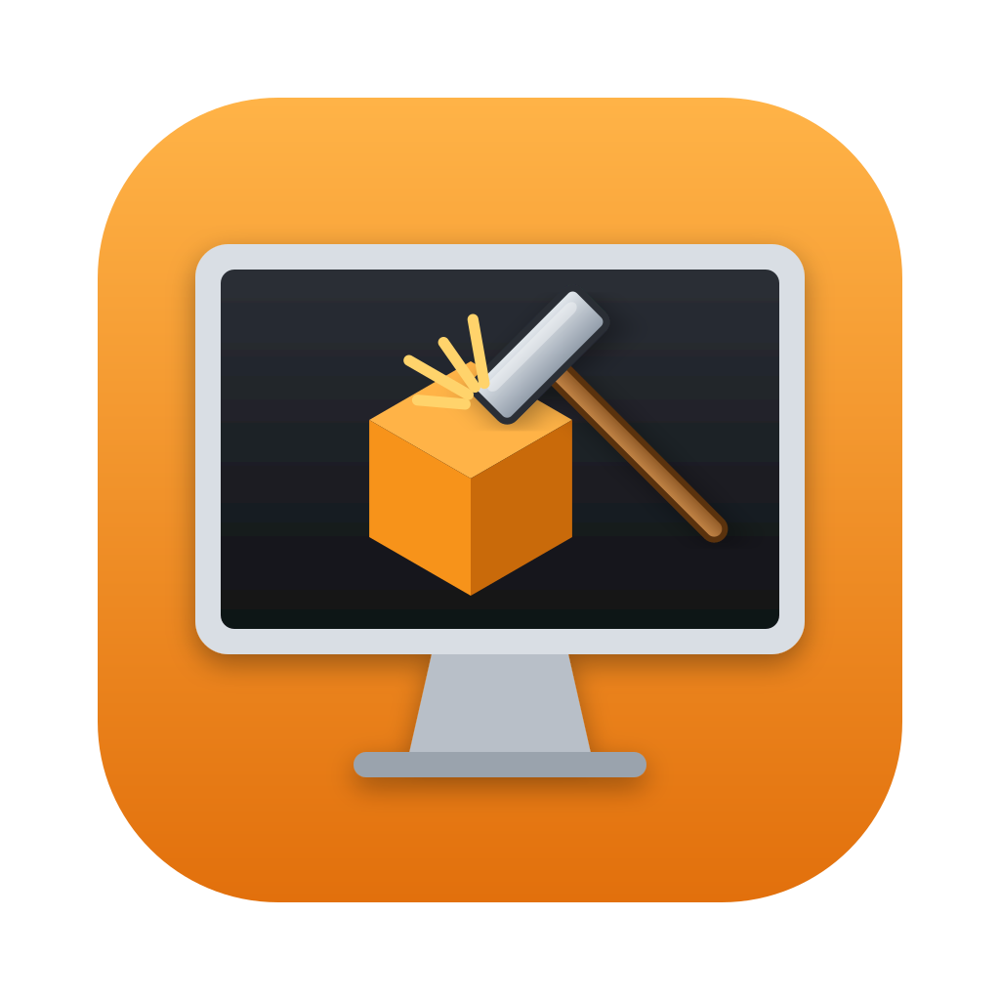
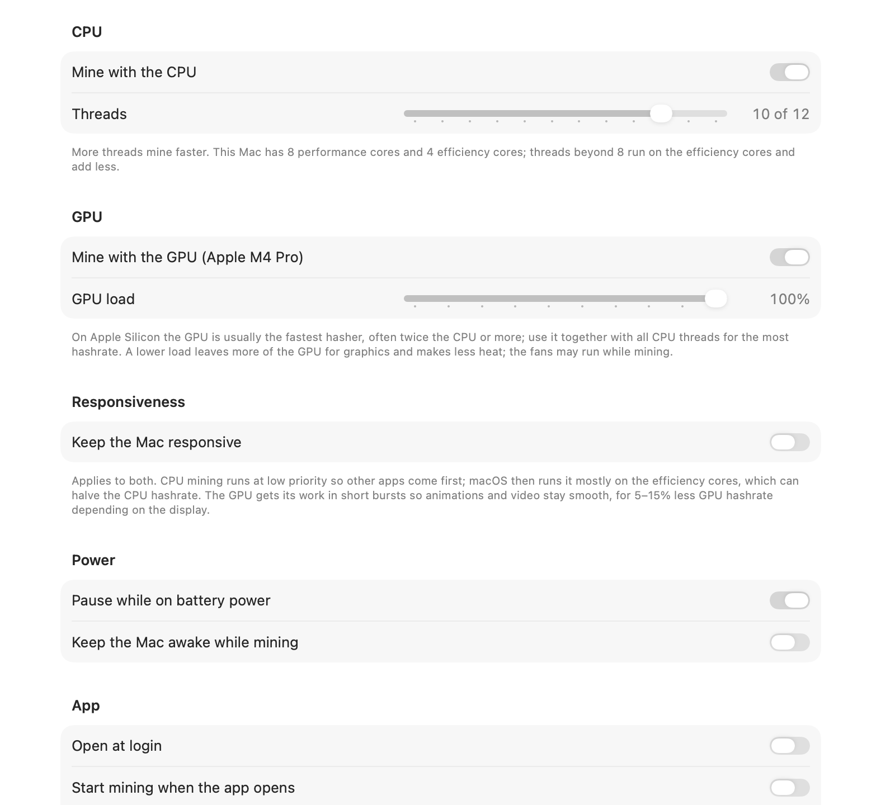

<p align="center">
  
</p>

# BLAKE2b Miner

A fast CPU and GPU miner for macOS for the **Bitcoin Knots BLAKE2b chain**
(header v2 proof of work, live since block 961,640). It runs as a small
menu-bar app, and also ships a command-line tool. On an M4 Pro Mac mini it
mines at about **1 GH/s** with the CPU and GPU together.

<p align="center">
  
</p>
<p align="center">
  
  &nbsp;
  
</p>

**Built for decentralization: by default, your own node builds the blocks you
mine.** The app shows who builds the blocks for every mode:

| Mode | Who builds the blocks | How |
| --- | --- | --- |
| **My own DATUM Gateway** (recommended) | ✅ **You** | The app runs a [DATUM Gateway](https://github.com/CONVOYMining/datum_gateway) next to your Knots node. Join a DATUM pool, where the pool only coordinates payouts, or mine solo. |
| **Solo, directly with my node** | ✅ **You** | Templates straight from your Knots node; a block you find pays you in full. |
| Pool-hosted gateway | ⚠️ The pool | Connect to a pool's public gateway. Simplest, but the pool chooses the transactions. |

- **Runs on any Mac with macOS 13 Ventura or later**: one universal app for
  Apple Silicon and Intel, with the DATUM Gateway built in. No Python, Xcode,
  Homebrew or other dependencies.
- **Fast native engines**, CPU and GPU, each on or off with its own setting
  (see [Performance](#performance)):
  - CPU: a hand-written ARM64 assembly kernel that runs NEON (with the SHA3
    extension's `XAR` instruction) and the integer units side by side. Intel
    Macs use a portable C kernel.
  - GPU: a Metal kernel, with a load setting from 10% to 100%.
- **Verifiable**: built-in self-test against the official Knots test vectors
  and against real blocks from your node.

> **Be realistic.** A Mac is a tiny fraction of the network's hashrate. At
> 1 GH/s and difficulty 4.6 G, the expected time to solo-mine one block is
> about 600 years, and a pool share takes about 20 hours on average. Think of
> it as a lottery ticket that also supports the network's decentralization,
> not as income.

## Performance

Measured on a 12-core M4 Pro Mac mini (8 performance + 4 efficiency cores,
16-core GPU), with nothing else running:

| Setup | Hashrate |
| --- | --- |
| CPU, 6 threads | ~205 MH/s |
| CPU, 12 threads | ~330 MH/s |
| GPU only, 100% load | ~760 MH/s |
| **CPU 12 threads + GPU** (best) | **~1,030 MH/s** |

- With the GPU on, the CPU gives up some speed (about 330 → 267 MH/s) because
  both share the chip's power budget; the GPU keeps its full speed.
- The GPU load setting scales hashrate in proportion (50% gives about half),
  and leaves the rest of the GPU for graphics.
- *Keep the Mac responsive* keeps other apps at full speed (measured: a
  foreground task ran at 100% speed, against 71% without it). It costs about
  half the CPU hashrate, because macOS then runs mining mostly on the
  efficiency cores, and 5–15% on the GPU, depending on the display's refresh
  rate.
- Measure your own Mac with `b2bminer bench --gpu` (see
  [Command-line tool](#command-line-tool)).

## Install

1. Download `BLAKE2bMiner-<version>-macOS.dmg` (or `.zip`) from
   [Releases](../../releases) and drag **BLAKE2b Miner** to Applications.
2. Open it. The release builds aren't notarized by Apple, so the first time
   macOS will say it can't verify the developer:
   - macOS 15 and later: click **Done**, then open **System Settings ›
     Privacy & Security**, scroll down and click **Open Anyway**.
   - macOS 13–14: right-click the app, choose **Open**, then **Open**.

   Or run this in Terminal once:
   `xattr -dr com.apple.quarantine "/Applications/BLAKE2b Miner.app"`
3. The dashboard opens on first launch. Afterwards the app lives in the menu
   bar (a small display with a block); **Open Dashboard** brings the window back.

## Set up your node

You need [Bitcoin Knots](https://bitcoinknots.org) 29.4.1 or later, fully
synced on the BLAKE2b chain, with its RPC server enabled:

- **Bitcoin Knots app (Bitcoin-Qt):** Settings › Options › check **Enable
  RPC server**, then restart Knots. Or add `server=1` to `bitcoin.conf`.
- **bitcoind:** add `server=1` to `bitcoin.conf`.
- **For pooled DATUM mining** also add `blockmaxweight=785000` to
  `bitcoin.conf`, so every block your node builds has room for the pool's
  payout outputs.

The miner signs in to the node with its cookie file from the default data
directory (`~/Library/Application Support/Bitcoin`). If your node uses another
data directory or `rpcuser`/`rpcpassword`, set them on the **Node** page. An
RPC password is kept in your macOS Keychain.

## Mine with your own DATUM Gateway (recommended)

[DATUM](https://github.com/CONVOYMining/datum_gateway) lets you pool with
other miners while **your own node chooses the transactions and builds every
block**; the pool only coordinates the payouts, straight from the coinbase.
BLAKE2b Miner ships the CONVOY DATUM Gateway inside the app and runs it for
you. There's nothing to install or configure by hand.

1. **Dashboard › Mining:** choose *My own DATUM Gateway*, paste a payout
   address from your own wallet, and pick a DATUM pool, or *None* to mine solo
   through the gateway.
2. **Dashboard › Diagnostics › Run All Checks** should show green checks.
3. Click **Start Mining**. The menu shows the pool connection and your shares.

The built-in pools are **Lazarus**, **Omega Pool** and **RIPTIDE**. See
[Pools](#pools) for how they were chosen and how to add any other DATUM pool.

Each pool's public key authenticates the pool, so nobody can impersonate it
and redirect your payouts.

If the pool becomes unreachable, the gateway keeps mining solo by default
(any block pays you 100%); you can switch this off. You can also let ASICs on
your network mine through your gateway (Dashboard › Mining › Advanced).

> Pools set a minimum share difficulty. At 1,024 (Lazarus, Omega Pool) and
> about 1 GH/s (CPU and GPU) that's a share every 75 minutes or so, and about
> every 4 hours at 300 MH/s (CPU only). Payouts are tiny either way.

## Solo mining directly with your node

Choose *Solo, directly with my node* on the **Mining** page and set your
payout address. The miner builds blocks from your node's templates, and the
node validates each one (`getblocktemplate` proposal mode) before any hashing.
A block you find pays the full reward to you.

## Pool-hosted gateways

Some pools run Stratum servers that miners connect to directly. The built-in
one is [B2Pool](https://b2pool.io), in six regions, with share difficulty from 1
(see [Pools](#pools)). It's the simplest setup, but **the pool's node chooses
the transactions** in the blocks you mine, so the app marks it "The pool
builds the blocks". Some pools have announced that they'll favor miners who
build their own blocks. Use *My own DATUM Gateway* when you can.

To use another pool's Stratum server, choose **Custom server** and enter its
address (`host:port`, or `stratum+ssl://host:port` for TLS) and your payout
address as the username. **Test Server** checks that it works with this
miner before you mine.

## Pools

### Built-in pools

DATUM pools. Your own node builds every block; the pool only splits the
payout:

| Pool | Blocks in 7 days | Min. share difficulty | Fee | DATUM server | Live status |
| --- | --- | --- | --- | --- | --- |
| [Lazarus](https://pool.lazarus-xbt.xyz) | 201 | 1,024 | 0% through your own gateway | `datum.lazarus-xbt.xyz:28915` | [api/pool](https://pool.lazarus-xbt.xyz/api/pool) |
| [Omega Pool](https://omegapool.tech) | 57 | 1,024 | 0.5% | `omegapool.tech:28915` | [stats.json](https://omegapool.tech/stats.json) |
| [RIPTIDE](https://tides.maveth.ca) | 22 | 2,048 | 0% coinbase fee | `riptide.maveth.ca:29120` | [api/stats](https://tides.maveth.ca/api/stats) |

Pool-hosted. The pool's node builds the blocks:

| Pool | Blocks in 7 days | Min. share difficulty | Servers | Live status |
| --- | --- | --- | --- | --- |
| [B2Pool](https://b2pool.io) | 107 | 1 (set your own with the password `d=N`) | `de`, `hel`, `ord`, `lax`, `ua`, `hkg` `.b2pool.io:5555` | [api/v1/stats](https://b2pool.io/api/v1/stats) |

At difficulty 1,024 and about 1 GH/s (CPU and GPU), a share takes about 75
minutes on average; at 300 MH/s (CPU only), about 4 hours. Payouts are tiny
either way.

### How pools are chosen

A pool is built in only if it meets all three rules. They were checked on
2026-10-10, over the previous 1,008 blocks (about 7 days):

1. **It finds blocks.** The pool's tag appears in the coinbase of recent
   blocks on the chain, as read from a Bitcoin Knots node.
2. **It accepts low-difficulty shares.** A pool's minimum share difficulty
   decides how often a Mac gets credit: at 16,384 it's about one share a day,
   at 1,024 about one every 75 minutes. The minimum was measured on each
   pool's own server: the bundled gateway completed the encrypted DATUM
   handshake from a mainnet node, then reported the difficulty the pool set.
3. **It publishes live status.** A public page or API with the pool's
   hashrate, miners and blocks, so you can see that it's alive and check your
   shares.

The same check also confirmed each pool's public key: the handshake only
succeeds with the right key.

Pools that didn't meet the rules:

| Pool | Why it isn't built in |
| --- | --- |
| DXPool | It rejected a valid share from this app and built no block through DATUM in the week. It also requires difficulty 16,384 and showed a 25% fee for small miners. |
| AlphaPool | Difficulty 16,384, and it needs `blockmaxweight=740000` |
| CONVOY | Difficulty 16,384 |
| Xor Pool, Tyger Pool, Terminus | No blocks in the week |

If you chose one of these in an earlier version, it's kept as a custom pool
with a note, so your choice doesn't change without you. Pools change quickly
on a young chain, so the list is checked again for new releases.

### Add your own pool

Any other DATUM pool works. From the pool's DATUM setup instructions you need
three things:

- the **DATUM server host** (for example `datum.example.com`),
- the **port** (usually `28915`),
- the pool's **public key**: 128 hex digits, sometimes called `pool_pubkey`.

**In the app:** **Dashboard › Mining › My own DATUM Gateway › DATUM pool ›
Add a pool…**, enter the name, host, port and public key, and click
**Save**. The pool is added to the list and chosen. Select it later to
**Edit…** or **Remove** it.

**From a terminal:**

```sh
b2bminer datum --address <your address> --pool-host datum.example.com:28915 --pool-key <128 hex digits>
```

Things to know:

- **The public key is required.** It's the pool's identity: your gateway
  refuses a server that can't prove it holds the matching private key, so
  nobody can pose as the pool and take your payouts. The bundled gateway
  won't connect to a pool without a key.
- **Check the pool's requirements.** Most need `blockmaxweight=785000` in
  `bitcoin.conf` (Diagnostics checks it); some ask for a different value.
- **Pools only work on mainnet.** On a test chain the app refuses to connect,
  so test work never reaches a real pool.
- **The log shows the pool's verdict on every share.** "Share accepted by
  your gateway, sent to <pool>", then "<pool> accepted your share", or
  "rejected your share: <reason> (code N)". If a pool rejects every share,
  the dashboard warns you; try another pool.

## The app

BLAKE2b Miner lives in the **menu bar**: click its icon (a small display with a
block, solid while mining) for your hashrate,
next share or expected block, and Start/Stop. **Open Dashboard** (⌘D) opens
the main window. You can also open it by opening the app again from Finder or
Spotlight. The window can be resized or made **full screen**, and while it's
open the app also appears in the Dock.

| Page | What's there |
| --- | --- |
| **Overview** | Live hashrate (split into CPU and GPU when the GPU mines), a one-hour hashrate chart, shares or expected block, pool connection, blocks found, recent activity. |
| **Mining** | How to mine (own DATUM Gateway, solo, or a pool-hosted gateway), your payout address (checked as you type), and the pool. |
| **Performance** | Mine with the CPU (threads) and/or the GPU (load 10–100%), *Keep the Mac responsive* (CPU at lower priority, GPU in short bursts), pause on battery, keep the Mac awake, open at login, start mining when the app opens, hashrate in the menu bar. |
| **Node** | How to reach Bitcoin Knots: address, port, data directory, optional RPC user and password. |
| **Diagnostics** | **Run All Checks**: node reachable, synced, BLAKE2b templates, payout address in your wallet, `blockmaxweight`, and the hashing against the official test vectors and your node's recent blocks. |
| **Log** | Everything the miner and its DATUM Gateway report. |

If something stops mining (for example, Knots isn't running), the menu and
the Overview say so and offer **Show Log** and **Run Checks**.

Only one copy mines at a time: opening a second copy of the app (say, from
another folder) shows the running copy's dashboard and quits, and `b2bminer`
waits while the app is mining, and the other way round.

## Updates

The app checks GitHub for a new release at launch and once a day. When one
is out, the dashboard and the menu offer **Install Update**: the app
downloads it, verifies it against the release's `SHA256SUMS.txt`, checks it's
BLAKE2b Miner at that version, swaps it in place and reopens. If mining
starts at launch, it resumes by itself. **About › Check for Updates** checks
right away, and *Check for updates automatically* (also under Performance ›
App) turns the daily check off. From a terminal: `b2bminer version --check`.

## Troubleshooting

| Problem | What to do |
| --- | --- |
| "No RPC cookie found" | Knots isn't running, its RPC server is off (`server=1`), or it uses another data directory: set it in **Settings › Node**. |
| "The node is still syncing" | Wait until Knots has synced; mining before that would waste work. |
| "not a BLAKE2b (header v2) block" | The node isn't Bitcoin Knots 29.4.1+ on the BLAKE2b chain. |
| ⚠️ blockmaxweight in Diagnostics | Add `blockmaxweight=785000` to `bitcoin.conf` and restart Knots (pooled DATUM only). |
| "is a mainnet pool, but your node is on …" | DATUM pools only work with a mainnet node; choose *None* to mine solo on a test chain. |
| Shares stay at 0 | Normal with a pool: at difficulty 1,024 and 1 GH/s a share takes about 75 minutes on average, see the *Next share* time in the menu. Turning on the GPU (Settings › Performance) helps the most. |
| "… rejected your share" | The pool checked the share and refused it; the log gives its reason. If a pool rejects every share, choose another DATUM pool. |
| The Keychain asks for access after an update | The app's signature changes with each release; choose **Always Allow**. |
| Hashrate is lower than expected | Turn on *Mine with the GPU*, use all CPU threads, turn off *Keep the Mac responsive*, and keep the Mac on power (it pauses on battery). Background work such as Photos analysis (`mediaanalysisd`) also takes CPU and GPU time. |
| GPU mining is unavailable | The Mac has no Metal GPU, or Metal reported an error (see the Log); CPU mining continues. |

The full log is on the dashboard's **Log** page, or in `~/Library/Logs/BLAKE2bMiner/miner.log`.

## Uninstall

Quit the app (menu › **Quit**, which also stops its DATUM Gateway), then delete:

```sh
rm -rf "/Applications/BLAKE2b Miner.app" \
       ~/Library/Application\ Support/BLAKE2bMiner ~/Library/Logs/BLAKE2bMiner
defaults delete io.github.taimouralneimat.blake2bminer
security delete-generic-password -s io.github.taimouralneimat.blake2bminer 2>/dev/null
```

`found-blocks.jsonl` is in the Application Support folder: keep a copy if it
holds anything.

## Command-line tool

The app bundle contains `b2bminer`, for terminals, servers and scripts:

```sh
B="/Applications/BLAKE2b Miner.app/Contents/MacOS/b2bminer"
"$B" datum --address <addr> --pool lazarus         # your own gateway, pooled (recommended)
"$B" datum --address <addr> --pool lazarus --gpu   # the same, with the GPU too
"$B" datum --address <addr> --pool-host <host[:port]> --pool-key <hex>   # any other DATUM pool
"$B" datum --address <addr> --pool none            # your own gateway, solo
"$B" solo --address <addr>                         # solo, directly with your node
"$B" stratum --url <host:port> --user <addr>       # a pool-hosted or remote gateway
"$B" pools                                         # list DATUM pools and pool-hosted gateways
"$B" probe --url <host:port> --user <address>      # test a pool without mining
"$B" check --address <addr> --pool lazarus         # check your node setup
"$B" selftest --node                               # verify hashing (and against your node)
"$B" bench --gpu                                   # measure this Mac's hashrate (CPU + GPU)
"$B" --help
```

Hardware options work with every mining command and `bench`: `--threads N`,
`--gpu`, `--gpu-load 10-100`, `--no-cpu` (with `--gpu`) and `--low-priority`
(keep the Mac responsive).

## How it works

The BLAKE2b proof of work ([Knots PR #359](https://github.com/bitcoinknots/bitcoin/pull/359),
`CBlockHeader::GetHash()` in `src/primitives/block.cpp`) hashes a 164-byte
header in layers: tagged SHA-256 commitments, then a first BLAKE2b, then a final
BLAKE2b over an 80-byte input. Only the final BLAKE2b depends on the nonces.
The miner computes everything else once per block template. Each CPU thread
then sweeps its own range of `nonce2`/`nNonce` values, three nonces at a
time. On Apple Silicon a hand-scheduled assembly kernel
(`scripts/gen_blake2b_arm64.py`) hashes two of them in a NEON vector, using the
SHA3 extension's `XAR` instruction for BLAKE2b's xor-and-rotate, and the third
in the integer units at the same time, with every value kept in a register.
That is about twice the speed of the portable C kernel (`scripts/gen_blake2b.py`),
which Intel Macs use and which the self-test checks the assembly against. The
round-0 work that doesn't depend on the nonce is precomputed, and a quick check
on the first output word rejects almost every nonce before any full comparison.

With GPU mining on, a Metal kernel (`scripts/gen_blake2b_metal.py`, built from
the same operation list as the assembly kernel) hashes millions of nonces per
batch, keeping 64-bit words as 32-bit halves, which the GPU handles natively.
The GPU searches nonces with the top bit of `nonce2` set and the CPU threads
the rest, so they never repeat each other's work. Every GPU hit is re-checked
on the CPU with the full hash before it is used. Batches run back to back,
sized to take about 25 ms each. In responsive mode they take half a frame of
the fastest display (4–8 ms), so the screen can redraw between them. Below
100% load the GPU works at full speed for that share of each quarter second
and rests the remainder, which keeps its clock up.

In solo mode, before mining a template, the miner asks the node to validate
the complete block (`getblocktemplate` proposal mode, which checks everything
except proof of work). Before submitting a solution, it re-checks the hash with
an independent reference implementation.

| Source | Contents |
| --- | --- |
| `Sources/CEngine` | CPU hashing engine (C), portable BLAKE2b, and the generated kernels: ARM64 assembly and portable C |
| `Sources/MinerCore` | The miner: `Engine` (CPU and GPU), `GPUEngine` (Metal; kernel generated into `GPUKernel.swift`), header v2 hashing, node RPC, solo block building, Stratum client, DATUM Gateway management, self-test |
| `Sources/MinerUI` | The app's SwiftUI views and model |
| `Sources/BLAKE2bMinerApp` | The menu-bar app |
| `Sources/b2bminer` | Command-line tool |
| `Sources/UISnapshots` | Developer tool: renders every screen to PNG (`scripts/ui-snapshots.sh`) |
| `scripts/` | App packaging and icon (`gen_logo.py` → `docs/images/logo.svg`), DATUM Gateway build (pinned, static, universal), kernel generators (`gen_blake2b*.py`), end-to-end and Intel tests |

## Build from source

Requires macOS 13+ and the Xcode Command Line Tools (`xcode-select --install`);
the full Xcode is not needed. Building the bundled DATUM Gateway also needs
`cmake` and `pkg-config` (`brew install cmake pkg-config`).

```sh
swift build -c release                     # app + CLI for this Mac
.build/release/b2bminer selftest
scripts/build-datum-gateway.sh             # universal, statically linked DATUM Gateway
scripts/build-app.sh                       # universal .app, .zip and .dmg in dist/
```

DATUM mode looks for `datum_gateway` next to its own executable, as in the
app bundle. To run DATUM mode from `.build/release`, point it at the gateway:
`B2B_DATUM_GATEWAY=build/datum/datum_gateway .build/release/b2bminer datum …`

### Tests

```sh
swift build -c release && .build/release/b2bminer selftest --node   # vectors, CPU and GPU kernels, your node's blocks
scripts/test-e2e.sh                        # mines real blocks on a throwaway regtest chain
scripts/test-intel.sh                      # the Intel build under Rosetta (Apple Silicon Macs)
```

(After `scripts/build-app.sh`, `.build/release` points at the Intel build;
`swift build -c release` points it back at this Mac's.)

`test-e2e.sh` starts a private regtest Knots node with BLAKE2b active, then
runs three stages:

1. **Solo** with CPU threads: every block is accepted, and the first includes
   the mempool's transactions.
2. **GPU only**: blocks found by the GPU are accepted by the node.
3. **DATUM** with the CPU and GPU: `b2bminer datum` starts the bundled gateway
   next to the node and mines through it. Blocks are accepted, no share is
   rejected as invalid, the coinbase pays the right address, and mining
   recovers when the node restarts.

Pooled DATUM mining is refused on test chains, so tests never touch a real
pool.

## Security

See [SECURITY.md](SECURITY.md): how payouts and credentials are protected,
and how to report a vulnerability. Changes are listed in
[CHANGELOG.md](CHANGELOG.md).

## License

MIT. See [LICENSE](LICENSE). The bundled DATUM Gateway and its libraries are
listed with their licenses in [THIRD_PARTY_NOTICES.md](THIRD_PARTY_NOTICES.md).
